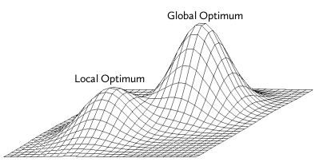

## Inspiration

- [David Hamilton's 1987 Paper](https://www.researchgate.net/profile/David_Hamilton23/publication/272559796_Sometimes_R_2_r_2_yx_1_r_2_yx_2_Correlated_Variables_Are_Not_Always_Redundant/links/557825c108ae753637548c1b.pdf) Sometimes $R^2 > r^2_{yx_1} + r^2_{yx_2}$ Correlated Variables Are Not Always Redundant
- Hamilton gave an example when two variables were negatively correlated
and neither did a good job in explaining the response on their own,
but together they explained nearly all the variance ($R^2 \approx 1$)
- Could negatively correlated variables impact stepwise regression?


## Stepwise Selection

- Greedy algorithm
- Problems if neither variable is significant on its own, but together they
are both significant




## My Paper

- Algorithms that consider adding highly negatively correlated variables together,
and additionally any variables correlated with those are discussed and tested.


## Algorithms Overview

- Step: Name given to the traditional stepwise regression algorithm
- Step2: New algorithm that improves Step by considering treating highly
negatively correlated covariates as singles or as a block
- Step3: Uses recursion on the blocks of Step2 and the correlation between covariates
to additionally make larger sized blocks


## Step2 Overview

- In the case of highly negatively correlated covariate pairs, Step2 will
consider the traditional choices of adding a single variable,
but also the option of adding both negatively correlated
covariates to the model (refered to as a block)
- What constitutes a highly negatively block is determined by the parameter `cor_cutoff`
- In this paper `cor_cutoff` = -0.5 was used
- While both Step and Step2 are greedy algorithms, Step2 looks two steps
ahead at highly negatively correlated covariate pairs
- AIC or BIC is used as the metric for deciding which of the possible models
is the best at each step


##

```{r, eval=FALSE, echo=TRUE}
let pairs = {(x,y) | cor(x,y) > cor_cutoff}
let BIC = BIC of intercept only model
let formula = intercept only model

loop
  next_formulas += {(formula + y) | y not in formula}
  next_formulas += {(formula + x + y)
    | x, y in pairs and neither in formula}

	let X = glm fitted for each formula in next_formulas
	let min_BIC = min BIC for the models in X
	let min_formula = formula for min_info_crit model

	if(min_info_crit <= cur_info_crit) {
		cur_info_crit = min_info_crit
		current_formula = min_formula
		next_formulas = empty list
  } else {return glm fitted with cur_form}
end loop
```

## Step2 Time Complexity

- Depends on the choice of `cor_cutoff`
- Often within a constant of Step
- Worst case is `p` times the runtime of Step, where `p` is the number of covariates


## Step3 Block Selection

- $\text{CC}$ := correlation cutoff, $-1 < \text{CC} < 0$
- Let $\text{RCP}$ := positive recursive correlation cutoff, $0 < \text{RCP} < 1$
- $\text{RCN}$ := negative recursive correlation cutoff, $-1 < \text{RCN} < 0$
- In this paper $\text{CC}$ = -0.5, $\text{RCP}$ = 0.5, $\text{RCN}$ = -0.5 (arbitrarily)
- Let $r(x_1,x_2)$ denote the sample correlation between $x_1$ and $x_2$
- Let $S_1$ denote the set of covariates
- Then $S_2$ denoting the set of highly negatively correlated pairs $(x_1,x_2)$ is defined as
$S_2 = \{(x_1, x_2) \, | \, x_1 \in S_1 \text{ AND } x_2 \in S_1 \text{ AND } x_1 \neq x_2 \text{ AND }  r(x_1,x_2) < \text{CC} \}$
- Then $S_3$ denoting the set of triples $(x_1,x_2,x_3)$ is defined as
$S_3 = \{ (x_1, x_2, x_3) \, | \, (x_1,x_2) \in S_2 \, \land x_3 \, \in S_1 \, 
\land \,  x_3 \notin (x_1, x_2) \land  \left(\text{block } x_1 \, x_2 \, x_3 \right) \}$
- where $\text{block } x \, y \, z = (r(x,z) < \text{RCN}) \lor (r(x,z) > \text{RCP}) \lor (r(y,z) < \text{RCN}) \lor (r(y,z) > \text{RCP})$


## Step3 Time Complexity

- Depends on the choice of algorithm parameters
- Hyperparameters can be chosen to make runtime within a constant of Step
- Worst case with a maximum block size of $\text{mbs}$ is $\mathcal O\left( p ^ {(\text{mbs}-1)}\right)$ times greater than Step


## Linear Model Setup

- $\mathbf Y = \beta_0 + \beta_1 \mathbf X_1 + \beta_2 \mathbf X_2 + \cdots + \epsilon$
- $\mathbf X_i$ are correlated, centred random normal variables
- Intercept ($\beta_0 = 9$)
- $\epsilon \sim \mathcal N(\mu = 0, \sigma = 1)$
- $n = 100$
- 1000 Simulations


## Model 1 : Two negatively correlated

This model is designed to show the advantage of Step2 over Step

$$ \boldsymbol{\Sigma} =\begin{bmatrix}
1   &-0.8 & 0 & 0 & 0 & 0 \\
-0.8& 1   & 0 & 0 & 0 & 0 \\
0   & 0   & 1 & 0 & 0 & 0 \\
0   & 0   & 0 & 1 & 0 & 0 \\
0   & 0   & 0 & 0 & 1 & 0 \\
0   & 0   & 0 & 0 & 0 & 1
\end{bmatrix} \hspace{10pt}
\hspace{20pt}
\boldsymbol{\beta} = \begin{bmatrix} 1 \\ 1 \\ 0 \\ 0 \\ 0 \\ 0 \end{bmatrix}$$


## Model 2: Three Negatively Correlated

This model is designed to show the advantage of Step3 over Step2 and Step

$$\boldsymbol{\Sigma} = \begin{bmatrix}
1     & -0.8  & 0.25  & 0 & 0 & 0 & 0 & 0 & 0 & 0 \\
-0.8  & 1     & -0.75 & 0 & 0& 0 & 0 & 0 & 0 & 0 \\
0.25  & -0.75 & 1     & 0 & 0& 0 & 0 & 0 & 0 & 0 \\
0     & 0     & 0     & 1 & 0& 0 & 0 & 0 & 0 & 0 \\
0     & 0     & 0     & 0 & 1 & 0 & 0 & 0 & 0 & 0 \\
0     & 0     & 0     & 0 & 0 & 1 & 0 & 0 & 0 & 0 \\
0     & 0     & 0     & 0 & 0 & 0 & 1 & 0 & 0 & 0 \\
0     & 0     & 0     & 0 & 0 & 0 & 0 & 1 & 0 & 0 \\
0     & 0     & 0     & 0 & 0 & 0 & 0 & 0 & 1 & 0 \\
0     & 0     & 0     & 0 & 0 & 0 & 0 & 0 & 0 & 1 \\
\end{bmatrix}
\hspace{10pt}
\hspace{20pt}
\boldsymbol{\beta}  =
\begin{bmatrix} 1 \\ 1 \\ 1 \\ 0 \\ 0 \\ 0 \\ 0 \\ 0 \\ 0 \\ 0
\end{bmatrix}$$

```{r models, echo=FALSE}
library(SelectionSimulator)
twoNeg <- readRDS("./../simulations/twoNeg.RDS")
threeNeg <- readRDS("./../simulations/threeNeg.RDS")
```


## Results Model 1

- Due to the correlation matrix it is highly likely that Step2 and Step3 perform identically
- Step2 and Step3 offer a considerable improvement over Step


## Fitted Coefficients

```{r two_neg_plot_1, echo=FALSE}
betas_heat_map(twoNeg)
```


## Proportion Included

```{r, echo=FALSE}
proportion_included(twoNeg)
```

Note that X1 and X2 were always included together or not at all


## Inclusion Order (Top 5)

```{r, echo=FALSE}
inclusion_order(twoNeg, pdf_head = 5)
```


## Training SSE

```{r, echo=FALSE}
training_sse_boxplot(twoNeg)
training_sse2kable(twoNeg)
```


## Test SSE

```{r, echo=FALSE}
test_sse_boxplot(twoNeg)
test_sse2kable(twoNeg)
```


## Results Model 2

- Step2 improves over Step
- Step3 uses blocksizes of 3 and improves over Step2


## Fitted Coefficients

```{r, echo=FALSE}
betas_heat_map(threeNeg)
```


## Proportion Included

```{r, echo=FALSE}
proportion_included(threeNeg)
```


## Inclusion Order (Top 5)

```{r, echo=FALSE}
inclusion_order(threeNeg, pdf_head = 5)
```


## Training SSE

```{r, echo=FALSE}
training_sse_boxplot(threeNeg)
training_sse2kable(threeNeg)
```


## Test SSE

```{r, echo=FALSE}
test_sse_boxplot(threeNeg)
test_sse2kable(threeNeg)
```


## Conclusions

- Step2 and Step3 offer improvements to the traditional stepwise algorithm in
the case of highly negatively correlated covariates, in terms of model fit
- Step2 and Step3 can suffer from longer runtimes, especially when their algorithm
parameters are chosen without regard to runtime


## References

- [David Hamilton's 1987 Paper; Sometimes $R^2 > r^2_{yx_1} + r^2_{yx_2}$, Correlated Variables Are Not Always Redundant](https://www.researchgate.net/profile/David_Hamilton23/publication/272559796_Sometimes_R_2_r_2_yx_1_r_2_yx_2_Correlated_Variables_Are_Not_Always_Redundant/links/557825c108ae753637548c1b.pdf)
- View source code at [github.com/riley-ashton/Selection/tree/master/R](https://github.com/riley-ashton/Selection/tree/master/R)
- View report & presentation code at [github.com/riley-ashton/Selection-Report](httpsgithub.com/riley-ashton/Selection-Report)

